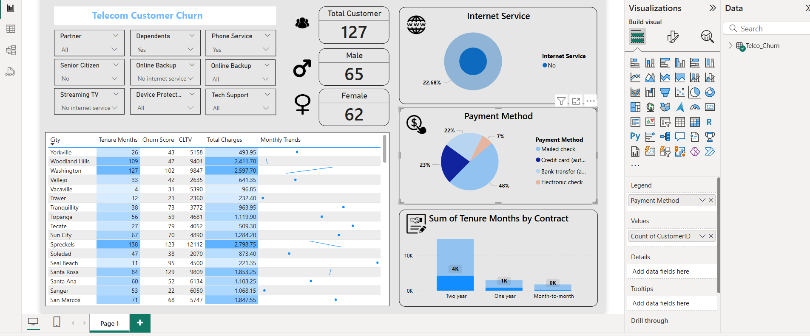

Telecom Customer Churn Dashboard
This Power BI dashboard provides insights into telecom customer churn, including:

✅ Customer demographics (age, gender, dependents, senior citizens)
✅ Service usage patterns (internet, phone, streaming TV, etc.)
✅ Payment methods
✅ Contract types and tenure analysis
✅ Churn score and CLTV overview by city

The dashboard enables easy filtering and analysis to help understand the factors influencing customer churn.

Dashboard Preview

Features
📊 Interactive slicers for partner status, dependents, phone service, and more

📈 Monthly trends sparkline by city

🔍 Payment method and contract type visualizations

👤 Gender and total customer breakdown

How to Use
Open the .pbix file in Power BI Desktop.

Apply different slicers to analyze churn drivers.

Customize visuals or add new ones as needed.
